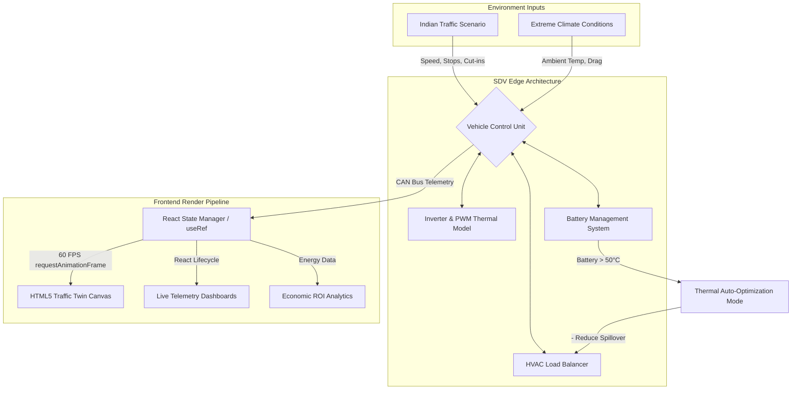

<div align="center">
  
  <br/>
  <h1>🚀 IndiTraffic SDV Edge Architecture</h1>
  <p><strong>Next-Generation Software-Defined Vehicle (SDV) Digital Twin & Simulation Platform tailored for Indian Traffic Dynamics</strong></p>

  []()
  []()
  []()
  []()
</div>

<hr/>

## 📖 Table of Contents
- [About the Project](#-about-the-project)
- [Key Features](#-key-features)
- [System Architecture & Pipeline](#-system-architecture--pipeline)
- [Workflow Flowchart](#-workflow-flowchart)
- [Getting Started (Local Development)](#-getting-started-local-development)
- [Project Structure](#-project-structure)
- [License](#-license)

---

## 🏎️ About the Project

**IndiTraffic SDV** is a state-of-the-art web-based simulation platform designed to evaluate and optimize Electric Vehicle (EV) and Software-Defined Vehicle (SDV) architectures under extreme Indian traffic and climate conditions. 

From Silk Board traffic crawls in Bangalore to Extreme Heatwaves in Delhi, this platform provides a **60 FPS Live Digital Twin** that computes real-time CAN bus telemetry, thermal optimization loads, regenerative braking efficiency, and total cost of ownership (TCO).

---

## ✨ Key Features

- 🚦 **Live Traffic Twin Canvas**: 60 FPS HTML5 Canvas rendering Indian traffic anomalies (auto-rickshaw cut-ins, two-wheeler lane splitting).
- 🌡️ **Extreme Climate Simulation**: Dynamically switch between *Delhi Heatwave (48°C)*, *Mumbai Monsoon*, and *North Indian Winter Fog*, affecting hydrodynamic drag, HVAC load, and battery thermal soaking.
- ⚡ **Auto Thermal-Optimization Engine**: Autonomous system intervention that sheds HVAC compressor spillover to prioritize powertrain cooling when the battery exceeds 50°C.
- 💻 **SDV Architecture Workbench**: Tweak Inverter PWM frequencies (10kHz vs 6kHz Adaptive) and Micro-Regen cutoff thresholds to see instant telemetry feedback.
- 📈 **Economic ROI Analytics**: Compare Legacy EV architectures with Next-Gen SDV setups to calculate hardware BOM savings, software-defined energy gains, and cost-per-km.
- 🛠️ **AUTOSAR & CAN Bus Vault**: Includes a dedicated Copilot for generating AUTOSAR C++ configurations and a streaming CAN HS1/HS2 telemetry viewer.

---

## 🏗️ System Architecture & Pipeline

The application operates as a **high-performance React Single Page Application (SPA)** driven by a localized data-simulation engine. 

1. **Simulation Engine**: An internal 1000ms loop acts as the Vehicle Control Unit (VCU), computing physics, thermal loads, and energy consumption based on active weather and traffic profiles.
2. **State Management**: React `useState` and `useRef` securely handle high-frequency telemetry bridging between the logic tier and the rendering tier without causing UI blocking.
3. **Rendering Layer**: 
    - The *DOM-based UI* (Gauges, Dashboards) utilizes **Tailwind CSS** and **Framer Motion** for silky-smooth layout transitions.
    - The *Digital Twin Canvas* utilizes raw HTML5 Canvas API via `requestAnimationFrame` for stutter-free 60 FPS graphics.
4. **Performance Monitor**: A dedicated continuous FPS hook guarantees real-time observability of browser rendering load.

---

## 🔄 Workflow Flowchart

Below is the workflow pipeline demonstrating how the environment interacts with the SDV Control Loop and the UI. It uses Mermaid to render directly in Markdown:



---

## 🚀 Getting Started (Local Development)

Follow these instructions to set up the project locally on your machine.

### Prerequisites
- **Node.js** (v18.0.0 or higher)
- **npm** (v9.0.0 or higher)

### Installation Steps

1. **Clone the repository**
   ```bash
   git clone https://github.com/your-username/inditraffic-sdv.git
   cd inditraffic-sdv
   ```

2. **Install dependencies**
   ```bash
   npm install
   ```

3. **Start the development server**
   ```bash
   npm run dev
   ```
   *The application will boot up at `http://localhost:3000` (or your configured Vite port).*

4. **Build for Production**
   To create an optimized production build:
   ```bash
   npm run build
   ```
   *Compiled assets will be output to the `/dist` directory.*

---

## 📂 Project Structure

```text
├── src/
│   ├── components/
│   │   └── indiTraffic/
│   │       ├── AppLoader.tsx                # Initial Boot Sequence Splash Screen
│   │       ├── ArchitecturalControlsPanel.tsx # Edge SDV configuration panel
│   │       ├── FPSMeter.tsx                 # 60FPS Performance HUD
│   │       ├── TrafficTwinCanvas.tsx        # High-performance HTML5 traffic renderer
│   │       ├── ThermalAndEfficiencyGauges.tsx # HUD gauges for temperatures and power
│   │       └── ...
│   ├── types/
│   │   └── indiTraffic.ts                   # TypeScript interfaces and architectures
│   ├── App.tsx                              # Main Application Component & Simulation Loop
│   ├── index.css                            # Global Tailwind Styles
│   └── main.tsx                             # React Entry Point
├── package.json                             # Dependencies and Scripts
├── vite.config.ts                           # Vite Build Configuration
└── README.md                                # Project Documentation
```

---

## 🛡️ License

Distributed under the MIT License. See `LICENSE` for more information.

<p align="center">
  <i>Built with precision for the next generation of Automotive Edge AI.</i>
</p>
